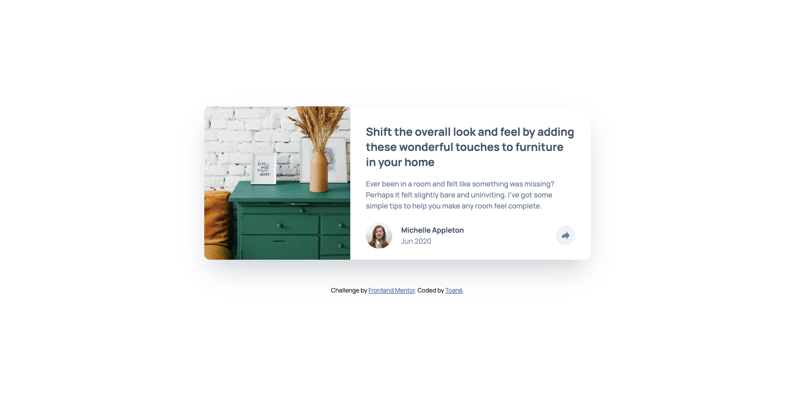

# Frontend Mentor - Article preview component solution

This is a solution to the [Article preview component challenge on Frontend Mentor](https://www.frontendmentor.io/challenges/article-preview-component-dYBN_pYFT). Frontend Mentor challenges help you improve your coding skills by building realistic projects. 

## Table of contents

- [Overview](#overview)
  - [The challenge](#the-challenge)
  - [Screenshot](#screenshot)
  - [Links](#links)
- [My process](#my-process)
  - [Built with](#built-with)
  - [Continued development](#continued-development)
- [Author](#author)

## Overview

### The challenge

Users should be able to:

- View the optimal layout for the component depending on their device's screen size
- See the social media share links when they click the share icon

### Screenshot

### Links

- Solution URL: [https://www.frontendmentor.io/solutions/article-preview-component--Ju2nAJD68](https://www.frontendmentor.io/solutions/article-preview-component--Ju2nAJD68)
- Live Site URL: [https://coder-txane.github.io/article-preview-component/](https://coder-txane.github.io/article-preview-component/)

## My process

### Built with

- Semantic HTML5 markup
- CSS custom properties
- Flexbox
- Mobile-first workflow
- [Styled Components](https://styled-components.com/) - For styles

### Continued development

I initially built this project using Tailwind CSS for the first time. While I was able to build with it, it made me realise how much more I needed to improve my CSS skills and understanding of NPM. Moving forward, I will also work on implenting more Semantic HTML in future projects.

## Author

- Frontend Mentor - [@coder-txane](https://www.frontendmentor.io/profile/coder-txane)